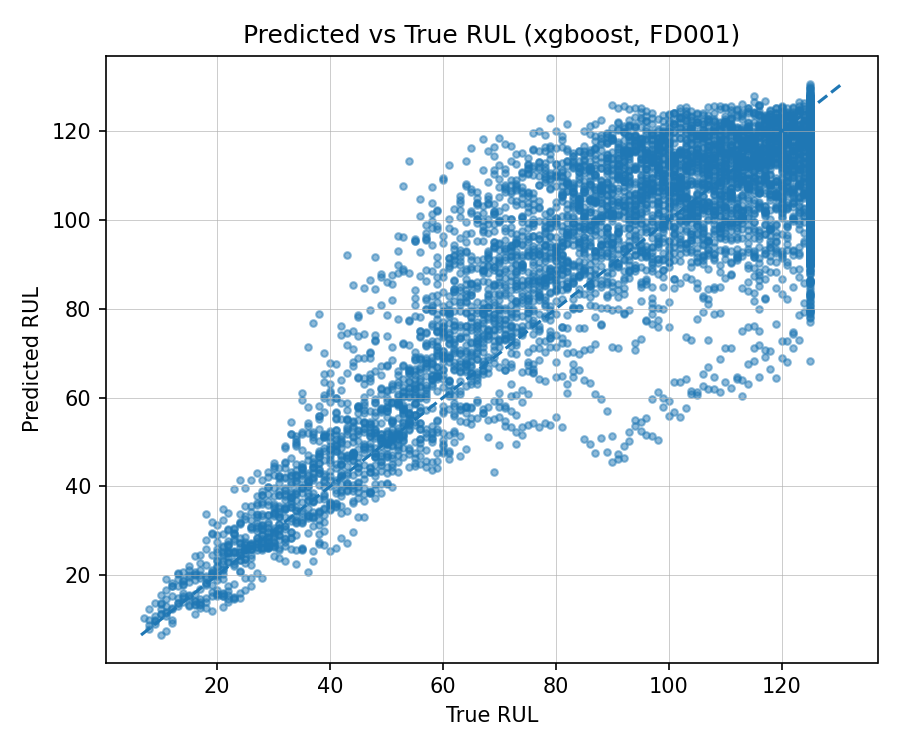
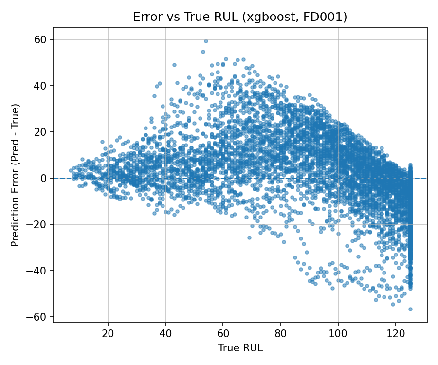
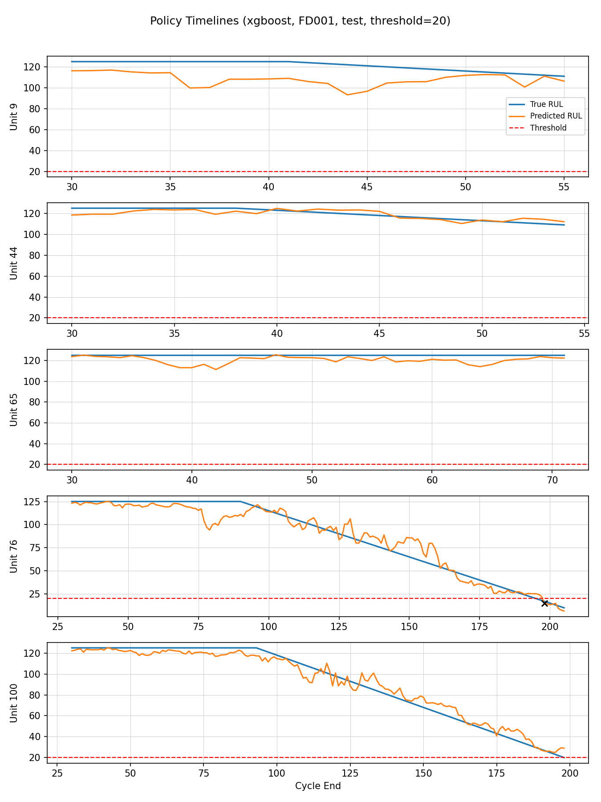

# Degradation-Aware Predictive Maintenance

Reliability-focused predictive maintenance workflow on NASA CMAPSS turbofan degradation data.

## Current Implemented Scope

- Leakage-safe RUL baseline modelling (`FD001` validated locally).
- Unit-level train/validation split to prevent unit leakage.
- Baseline model comparison (ridge, elasticnet, random forest, xgboost/lightgbm fallback, persistence).
- Decision-focused evaluation (stratified RUL bands, asymmetry diagnostics, weighted late/early cost).
- Trigger/policy evaluation with unit-level first-trigger analysis.
- Reproducible CLI pipeline and tests under `src/`, `scripts/`, and `tests/`.

## Planned Extensions

- Health Index (HI) construction and evaluation in production pipeline code.
- Sequence models (e.g., LSTM/TCN/Transformer variants) with controlled baseline comparison.
- Richer degradation trajectory modelling and policy calibration across FD002-FD004.

## Quickstart

```bash
git clone https://github.com/nana-kwame-safo/degradation-aware-predictive-maintenance.git
cd degradation-aware-predictive-maintenance
conda env create -f environment.yml
conda activate degradation-maintenance
python src/utils/env_check.py
```

Place CMAPSS files under `data/raw/cmapss/`:
- `train_FD001.txt`, `test_FD001.txt`, `RUL_FD001.txt`
- `train_FD002.txt`, `test_FD002.txt`, `RUL_FD002.txt`
- `train_FD003.txt`, `test_FD003.txt`, `RUL_FD003.txt`
- `train_FD004.txt`, `test_FD004.txt`, `RUL_FD004.txt`

## Reproduce Milestone 2 Outputs

```bash
python scripts/check_imports.py
python scripts/smoke_test.py --subset FD001
python -m src.run_baseline --subset FD001 --window 30 --val_fraction 0.2 --seed 42 --rul_cap 125
```

Expected generated outputs (local, not committed):
- `results/metrics/baselines_FD001.json`
- `results/tables/baseline_comparison_FD001.csv`
- `results/tables/baseline_stratified_metrics_FD001.csv`
- `results/tables/baseline_error_asymmetry_FD001.csv`
- `results/tables/baseline_alert_thresholds_FD001.csv`
- `results/tables/baseline_weighted_cost_FD001.csv`
- `results/tables/policy_eval_FD001_<model>.csv`
- `results/tables/policy_summary_FD001_<model>.csv`
- `results/figures/pred_vs_true_<model>_FD001.png`
- `results/figures/error_vs_rul_<model>_FD001.png`
- `results/figures/policy_timeline_<model>_FD001.png`

## Notebook Status

Notebooks under `notebooks/` are optional exploratory workspaces. The canonical, reproducible pipeline for this milestone is the script/module path (`src/` + `scripts/`).

## Curated Diagnostics





## Data And Artifact Commit Policy

Raw CMAPSS data and bulk generated run artifacts are intentionally excluded from git history:
- `data/raw/`, `data/interim/`, `data/processed/`
- `results/metrics/`, `results/tables/`, `results/figures/` (except `.gitkeep`)

This keeps the repository reproducible and lightweight while preserving scripts and report-ready curated outputs.
