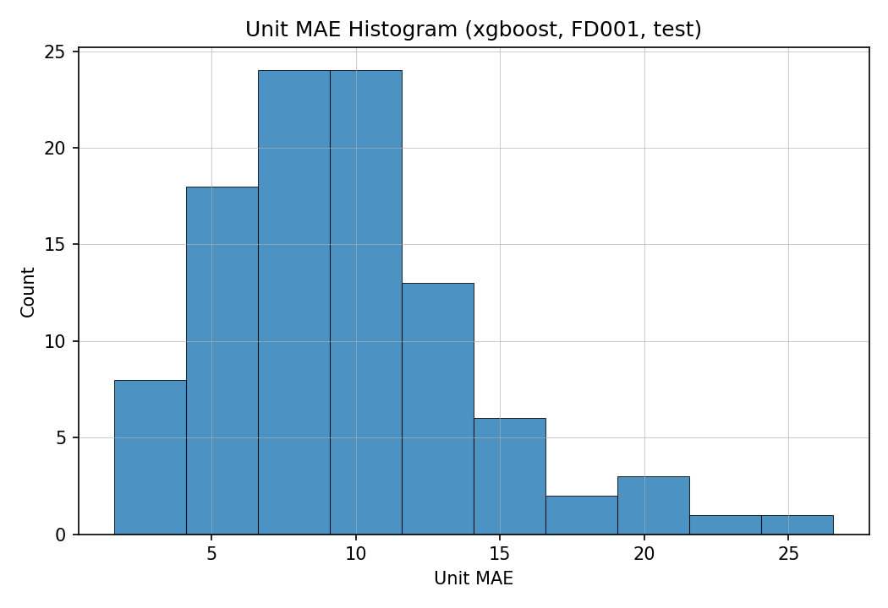

# 03 — Results and Discussion (Milestone 2)

This report summarizes the implemented Milestone 2 scope: leakage-safe RUL baseline modelling and decision/policy evaluation on CMAPSS FD001.

## 3.1 Experimental Scope

### Dataset and split

- Subset evaluated: `FD001`.
- Train/validation/test frame rows (from `results/metrics/baselines_FD001.json`):
  - train: `20,631`
  - validation: `3,852`
  - test: `13,096`
- Unit-level split policy: `val_fraction=0.2` on train units (FD001 train units split into train/validation groups); test units are held out.

### Leakage-control confirmation

- Split by `unit_id`: **Yes**
- Scaling fit on train split only, reused for val/test: **Yes**
- Window generation after split/scaling with per-unit boundaries: **Yes**

### Implemented tasks in this milestone

- RUL regression: **Yes**
- Decision-focused evaluation (error asymmetry, threshold sweep, weighted cost): **Yes**
- Unit-level policy trigger evaluation: **Yes**
- HI modelling in production pipeline code: **No (planned extension)**
- Sequence models in production pipeline code: **No (planned extension)**

## 3.2 Baseline Results — RUL Regression

### Model comparison (FD001)

Source: `results/tables/baseline_comparison_FD001.csv`

| Model | Validation MAE / RMSE | Test MAE / RMSE | Test RMSE (RUL 0-20) |
|---|---:|---:|---:|
| XGBoost | 9.51 / 13.19 | 10.07 / 13.66 | 4.61 |
| Random Forest | 10.01 / 13.50 | 11.24 / 14.88 | 4.33 |
| Ridge | 14.84 / 17.99 | 14.10 / 17.40 | 15.96 |
| ElasticNet | 16.68 / 20.51 | 16.21 / 20.15 | 14.31 |
| Persistence baseline | 49.04 / 55.74 | 65.23 / 71.46 | 15.50 |

Best overall model on test RMSE: **XGBoost**.

### Reliability-aware error interpretation

Sources:
- `results/tables/baseline_error_asymmetry_FD001.csv`
- `results/tables/baseline_stratified_metrics_FD001.csv`
- `results/tables/baseline_unit_summary_FD001.csv`

For XGBoost on test:
- signed mean error (overall): `-1.68` cycles
- EOL (0-20) signed bias: `+2.08` cycles (overestimation tendency near failure)
- EOL overestimation share: `69.92%`
- EOL severe overestimation share (`>=10` cycles): `4.88%`

Unit-level consistency (test):
- XGBoost unit MAE mean/median: `9.56 / 9.10`
- Random Forest unit MAE mean/median: `10.63 / 10.00`

### RUL band behavior (test)

Source: `results/tables/baseline_stratified_metrics_FD001.csv`

- Band `0-20` (near failure):  
  XGBoost MAE/RMSE = `3.57 / 4.61`; Random Forest MAE/RMSE = `3.35 / 4.33`.
- Band `21-50` (transition):  
  XGBoost MAE/RMSE = `7.82 / 10.93`; Random Forest MAE/RMSE = `9.37 / 12.81`.
- Band `51-125` (early-mid life):  
  XGBoost MAE/RMSE = `10.34 / 13.94`; Random Forest MAE/RMSE = `11.50 / 15.13`.

Interpretation:
- Both tree baselines remain strongest across bands.
- Random Forest is slightly better in strict near-failure RMSE, but XGBoost is better overall and clearly better in 21-125 bands.
- Linear baselines underperform materially on this feature space.

### Key findings

1. XGBoost is the strongest single baseline on overall validation/test MAE/RMSE.  
2. Near-failure performance is strong for both XGBoost and Random Forest, with Random Forest marginally lower EOL RMSE.  
3. XGBoost generalizes better through transition and early-life bands (`21-125`), which drives its best overall test RMSE.  
4. Directional bias near EOL is not negligible (positive EOL bias), so late-risk calibration still matters for deployment policy.  
5. Persistence is intentionally weak and serves as a sanity floor, confirming learned models capture degradation signal.

## 3.3 Decision-Focused Trigger Policy Evaluation

Default policy (from run config):
- trigger if `pred_rul <= 20`
- late trigger if `true_rul_at_trigger <= 5`
- false alarm if `true_rul_at_trigger > 30`

Source: `results/tables/policy_summary_FD001_xgboost.csv`

XGBoost test policy summary:
- trigger_rate: `0.13`
- false_alarm_rate: `0.00`
- late_trigger_rate: `0.00`
- observed-window non-trigger rate: `0.87`
- lead time mean/median: `20.38 / 20.0` cycles

Interpretation:
- The threshold-20 policy is conservative in this evaluation: few triggers, high lead time, and no false alarms among triggered units.
- Observed-window trigger coverage is conservative at threshold 20; future policy calibration should evaluate higher alert thresholds and full run-to-failure trajectories.
- Because CMAPSS test trajectories are truncated, high observed-window non-trigger rate should not be interpreted as confirmed missed failures without additional trajectory context.

## 3.4 Visual Diagnostics (Curated)

- 
- 
- 
- 

## 3.5 Status of HI and Sequence Modelling

- Health Index modelling: not part of the canonical Milestone 2 production pipeline yet.
- Sequence models: not integrated in `src/` training/evaluation path yet.

Both remain planned extensions and are intentionally not claimed as completed results in this milestone report.

## 3.6 Limitations and Next Steps

- Current validated benchmark slice is FD001; FD002-FD004 generalization is still pending.
- Policy metrics are sensitive to threshold choice and observed trajectory truncation.
- EOL directional bias (overestimation tendency) warrants explicit threshold/cost calibration for risk-sensitive deployments.
- CMAPSS is a benchmark proxy and does not include full operational maintenance constraints from live fleets.

## 3.7 Reproducibility Artifacts

Primary generated sources used here:
- `results/metrics/baselines_FD001.json`
- `results/tables/baseline_comparison_FD001.csv`
- `results/tables/baseline_stratified_metrics_FD001.csv`
- `results/tables/baseline_error_asymmetry_FD001.csv`
- `results/tables/baseline_unit_summary_FD001.csv`
- `results/tables/policy_summary_FD001_xgboost.csv`

Curated report figures are stored under `reports/figures/` for GitHub rendering.
